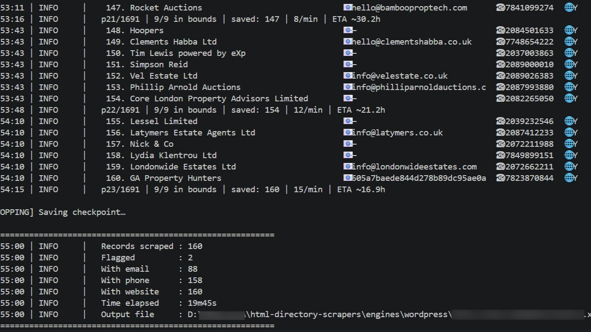
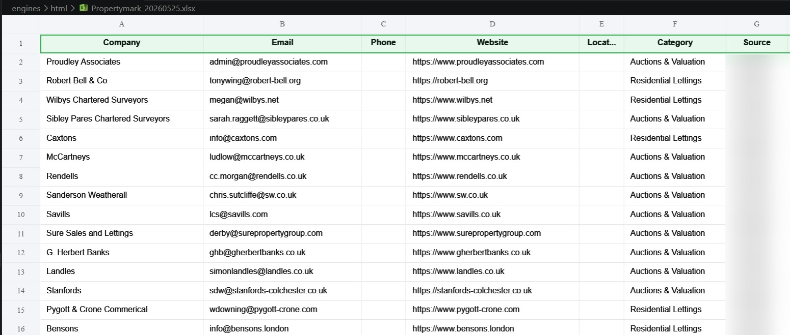

# HTML Directory Scrapers

**Two-engine Python toolkit for scraping any paginated HTML or WordPress AJAX business directory — config-driven, checkpoint-resumable, concurrent fetching, Cloudflare email decode, and professionally formatted three-sheet Excel export. Point either engine at a new directory with a single config file change. No code edits required.**

[](https://github.com/FAAQJAVED/html-directory-scrapers/actions/workflows/ci.yml)
[](https://python.org)
[](LICENSE)
[](tests/)
[](https://github.com/FAAQJAVED/html-directory-scrapers)

---

> Found this useful? A ⭐ on GitHub helps other developers find it.

---

## Table of Contents

- [Preview](#preview)
- [What It Does](#what-it-does)
- [Engines](#engines)
- [Use Cases](#use-cases)
- [Features](#features)
- [Performance](#performance)
- [What Data You Get](#what-data-you-get)
- [Quick Start](#quick-start)
- [Choosing an Engine](#choosing-an-engine)
- [Configuration Reference](#configuration-reference)
- [Output](#output)
- [Runtime Controls](#runtime-controls)
- [Auto-Protection Features](#auto-protection-features)
- [Resuming a Run](#resuming-a-run)
- [Prerequisites](#prerequisites)
- [Project Structure](#project-structure)
- [Running Tests](#running-tests)
- [Troubleshooting](#troubleshooting)
- [Known Limitations](#known-limitations)
- [Part of the B2B Lead Toolkit](#part-of-the-b2b-lead-toolkit)
- [License](#license)

---

## Preview

| Terminal — live progress bar | Excel Output — three sheets |
|---|---|
|  |  |

See [`assets/Sample_Output.csv`](assets/Sample_Output.csv) for realistic sample output rows.

---

## What It Does

1. **Reads config.yaml** — one file controls the target URL, CSS selectors (HTML engine) or AJAX parameters (WordPress engine), geographic filter, category mapping, rate limits, and output format.
2. **Discovers all listings** — paginates through every search-results page (HTML engine) or AJAX POST page (WordPress engine) to collect every profile URL or business marker.
3. **Fetches profile pages concurrently** — up to `--workers N` threads (default 3) fetch profile pages in parallel, decoding Cloudflare-obfuscated emails automatically.
4. **Filters by geography** — HTML engine: regex on location text. WordPress engine: lat/lng bounding box from AJAX map markers.
5. **Deduplicates** — by URL (HTML) or name + postcode composite key (WordPress).
6. **Exports to Excel** — a styled Data sheet (clean records), a Flagged sheet (excluded records with reason), and a Summary sheet (run metadata).

Everything is config-driven. The Python source files contain zero site-specific strings — every URL, selector, and parameter lives in `config.yaml`.

---

## Engines

| Engine | Target platform | Entry point | Unique technique |
|---|---|---|---|
| **HTML Scraper** | Any paginated HTML directory | `engines/html/scraper.py` | CSS selectors, listing→profile two-phase crawl, Cloudflare XOR email decode |
| **WordPress Scraper** | WordPress admin-ajax.php directories | `engines/wordpress/scraper.py` | Nonce extraction + mid-run refresh, AJAX POST pagination, manual gzip decompression |

---

## Use Cases

| Who uses it | What they do | Which engine |
|---|---|---|
| **Lead gen teams** | Scrape member directories to build B2B contact lists filtered to a city or region | Either, depending on the directory tech stack |
| **Property data analysts** | Extract letting agents, property managers, and sales agents from industry directories | WordPress engine (TPOS, similar) or HTML engine (Propertymark, similar) |
| **Market researchers** | Pull structured business datasets from trade association directories | HTML engine for static directories |
| **CRM admins** | Automate monthly refreshes of contact data from a membership directory | Either engine with cron / Task Scheduler |
| **Developers** | Adapt to any new directory in minutes using a new config.yaml | Copy config.yaml.example, fill in 5 fields, run |

---

## Features

| Feature | Detail |
|---|---|
| **Zero-code retargeting** | Point at any compatible directory by editing config.yaml — no Python changes needed |
| **Two-phase HTML crawl** | Phase 1: paginate listing pages and collect profile URLs. Phase 2: visit each profile for full contact details |
| **WordPress AJAX POST** | Posts directly to `admin-ajax.php` — the same endpoint the site's own search form uses |
| **Cloudflare XOR email decode** | Transparently decodes `/cdn-cgi/l/email-protection` and `data-cfemail` obfuscated emails |
| **Concurrent profile fetching** | `--workers N` (default 3, max 8) fetches profile pages in parallel — ~3× throughput vs sequential |
| **WordPress nonce auto-extraction** | Scrapes the nonce security token from the register page before the main loop; refreshes mid-run if expired |
| **Manual gzip/zlib decompression** | Sniffs magic bytes and decompresses AJAX responses that lack `Content-Encoding` headers |
| **Geographic filtering** | HTML engine: configurable regex on location text. WordPress engine: lat/lng bounding box from map markers |
| **Configurable postcode/ZIP extraction** | `postcode_regex` config key — works for UK postcodes, US ZIP codes, AU postcodes, or any pattern |
| **Atomic checkpoint writes** | Write-to-temp-then-rename — checkpoint survives a crash mid-write |
| **Three-sheet Excel export** | Data · Flagged · Summary — styled, dated, named from config |
| **Keyboard controls** | P pause · R resume · S stop · W stats — no Enter needed, event-driven (responds instantly) |
| **Auto-protection** | Stop time · low-disk guard · circuit breaker · `ConnectTimeout` instant skip on dead sites |
| **Configurable header colour** | WordPress engine: set `output.header_color` in config to distinguish scraper outputs at a glance |
| **123 tests** | Full offline test suite across both engines — no network calls, no API key needed |

---

## Performance

| Mode | Throughput | Notes |
|---|---|---|
| v1.0.0 sequential | ~12 records/min | One profile fetch at a time |
| v1.1.0 concurrent (3 workers) | ~35 records/min | ~3× improvement — default setting |
| v1.1.0 concurrent (5 workers) | ~50 records/min | Diminishing returns above 5 workers |

**Tuning guidance:**

- Use `--workers 3` (default) for polite scraping on shared-hosting directories.
- Use `--workers 5` for faster runs on directories with robust infrastructure.
- Never exceed `--workers 8` (enforced by a hard cap in `scraper.py`).
- Increase `delay_min` / `delay_max` in config if you receive HTTP 429 responses.
- `profile_timeout_seconds: 6` eliminates stalls on dead company websites — `ConnectTimeout` returns instantly.

**Expected runtime formula:**
```
minutes ≈ total_records / (workers × 12) × delay_avg
```

---

## What Data You Get

| Field | Example |
|---|---|
| Company | Acme Property Consultants Ltd |
| Email | info@acmeproperty.co.uk |
| Phone | 02071234567 |
| Website | https://www.acmeproperty.co.uk |
| Location | SW1A 1AA |
| Category | Residential Sales |
| Source | Directory |

See [`assets/Sample_Output.csv`](assets/Sample_Output.csv) for realistic sample output.

---

## Quick Start

### 1. Clone and install

```bash
git clone https://github.com/FAAQJAVED/html-directory-scrapers.git
cd html-directory-scrapers
```

### 2. Choose your engine and install dependencies

```bash
# HTML engine
cd engines/html
pip install -r requirements.txt

# WordPress engine
cd engines/wordpress
pip install -r requirements.txt
```

### 3. Configure

```bash
cp config.yaml.example config.yaml
```

Edit `config.yaml` — set your target URL, CSS selectors (HTML) or AJAX parameters (WordPress), and geographic filter. Every option is annotated in the example file.

### 4. Set secrets (if needed)

```bash
cp .env.example .env
```

Paste session cookies as `SCRAPER_COOKIES=...` (HTML) or `SCRAPER_COOKIES_RAW=...` (WordPress). Never stored in `config.yaml`.

### 5. Run

```bash
# Standard run
python scraper.py

# Use a different config file
python scraper.py --config my_config.yaml

# Start fresh (clears any saved checkpoint)
python scraper.py --fresh

# Increase concurrent workers for faster scraping
python scraper.py --workers 5
```

### 6. Optional: install as a CLI command

```bash
pip install -e ../../    # from either engine folder
html-scraper --config config.yaml
wp-scraper   --config config.yaml
```

---

## Choosing an Engine

Use the **HTML engine** if the directory renders its listings directly in the HTML page source — you can see company names and links when you use **View Source** in your browser.

Use the **WordPress engine** if you see POST requests to `/wp-admin/admin-ajax.php` in browser DevTools → Network tab when you trigger a search. The response will be a JSON object containing `markers` and `cards` data.

---

## Configuration Reference

### HTML Engine — key options

| Key | Type | Default | Description |
|---|---|---|---|
| `base_url` | string | — | Root URL of the target directory (required) |
| `list_path` | string | — | Path to the listing/search-results page (required) |
| `categories` | list | — | Category name objects `{name: ...}` (required) |
| `selectors` | dict | — | CSS selectors for card and profile elements (required) |
| `all_services` | list | `[]` | Service slugs to iterate; empty = single pass with no filter |
| `location_filter_regex` | string | `""` | Regex applied to profile page text; empty = no filter |
| `delay_min` / `delay_max` | float | 1.0 / 2.5 | Per-request random delay range in seconds |
| `profile_timeout_seconds` | int | 6 | Timeout for company profile page fetches |
| `verify_email` | bool | false | SMTP RCPT handshake per extracted email (slow) |
| `stop_at` | string | `""` | 24-hour time to auto-stop, e.g. `"23:00"` |
| `postcode_regex` | string | `""` | Regex to extract postcode/ZIP from card meta text |

### WordPress Engine — key options

| Key | Type | Default | Description |
|---|---|---|---|
| `base_url` | string | — | WordPress directory root URL (required) |
| `register_path` | string | — | Path to the search page for nonce extraction (required) |
| `ajax_action` | string | — | WordPress AJAX action name (required) |
| `sectors` | list | — | `[{name: ..., category: ...}]` objects (required) |
| `geo_bounds` | dict | none | `lat_min/max`, `lng_min/max` bounding box; omit to disable |
| `crawl_websites` | bool | true | Visit company websites to find emails |
| `postcode_regex` | string | `""` | Regex to extract postcode/ZIP from AJAX card addresses |
| `skip_domains` | list | `[]` | Website domains to exclude from company URL extraction |
| `junk_domains` | list | `[...]` | Email domains to reject |
| `output.header_color` | string | `"1F4E79"` | Hex colour for Excel header rows (no `#`) |

Full option documentation is in `config.yaml.example` inside each engine folder.

---

## Output

### Excel workbook — `{prefix}_{YYYYMMDD}.xlsx`

| Sheet | Contents |
|---|---|
| **Data** | Clean, validated records — frozen header row, navy header, alternating row shading, auto-width columns |
| **Flagged** | Records excluded by geographic filter or failed profile fetches, each with a `Flag Reason` column |
| **Summary** | Run metadata: date, source, record counts, email/phone/website hit rates, elapsed time, status |

### Log file — `scraper.log`

Timestamped console + file logging. Full DEBUG to file, clean INFO to console.

---

## Runtime Controls

While the scraper is running, press a key — no Enter needed on any platform. Controls are event-driven and respond instantly:

| Key | Action |
|---|---|
| `P` | Pause after current page completes |
| `R` | Resume from pause |
| `S` | Save checkpoint and stop cleanly |
| `W` | Print live stats snapshot (saved, flagged, email rate, ETA) |

**HTML engine only** — write to `command.txt` in the engine folder (useful for headless / cron runs):

```bash
echo pause  > command.txt
echo resume > command.txt
echo stop   > command.txt
echo fresh  > command.txt
```

---

## Auto-Protection Features

| Feature | Trigger | Behaviour |
|---|---|---|
| Stop time | Configured `HH:MM` | Saves checkpoint and exits cleanly |
| Low disk guard | Free disk < `min_free_disk_mb` | Auto-pauses; resume with R or `echo resume > command.txt` |
| Circuit breaker | 3 consecutive HTTP failures | Auto-pauses main session; resumes on R |
| ConnectTimeout skip | TCP-level host unreachable | Returns immediately — dead sites never stall the run |
| One retry on errors | ReadTimeout or connection error | Retries once with backoff before moving on |

---

## Resuming a Run

Both engines save a checkpoint after every listing page. If a run is interrupted for any reason, simply re-run — the checkpoint is detected and the run continues from exactly where it stopped.

```bash
python scraper.py           # automatically resumes if checkpoint exists
python scraper.py --fresh   # discard checkpoint and start fresh
```

---

## Prerequisites

| Requirement | Version | Notes |
|---|---|---|
| Python | ≥ 3.9 | Tested on 3.9, 3.10, 3.11, 3.12 |
| pip | any current | Bundled with Python |
| Git | any | For cloning |
| OS | Windows / Linux / macOS | Windows and macOS have CI smoke tests |

No browser driver (Playwright / Selenium) needed. Both engines use pure HTTP requests only.

---

## Project Structure

```
html-directory-scrapers/
├── assets/                          ← Preview images and sample output
│   ├── Terminal_Preview.png         # Live terminal screenshot
│   ├── Output_Preview.png           # Excel output screenshot
│   └── Sample_Output.csv            # Sample data rows
├── engines/
│   ├── html/                        ← HTML Directory Scraper
│   │   ├── scraper.py               # Thin orchestrator (CLI entry point)
│   │   ├── config.py                # YAML loader + env var injection
│   │   ├── fetcher.py               # httpx client, safe_get, progress, SMTP
│   │   ├── parser.py                # parse_cards, scrape_profile, CF email
│   │   ├── exporter.py              # 3-sheet Excel workbook
│   │   ├── checkpoint.py            # CheckpointManager (atomic JSON)
│   │   ├── controls.py              # command.txt watcher, InputController
│   │   ├── config.yaml.example
│   │   ├── .env.example
│   │   └── requirements.txt
│   └── wordpress/                   ← WordPress Directory Scraper
│       ├── scraper.py               # Thin orchestrator (CLI entry point)
│       ├── config.py                # YAML loader + env var injection
│       ├── fetcher.py               # Session, AJAX POST, nonce, safe_decode
│       ├── parser.py                # parse_cards, filter_by_bounds, profile
│       ├── exporter.py              # 3-sheet Excel workbook
│       ├── checkpoint.py            # CheckpointManager (atomic JSON)
│       ├── controls.py              # InputController (P/R/S/W keyboard)
│       ├── config.yaml.example
│       ├── .env.example
│       └── requirements.txt
├── tests/
│   ├── conftest.py
│   ├── html/
│   │   ├── conftest.py
│   │   └── test_html_engine.py      # 59 tests
│   └── wordpress/
│       ├── conftest.py
│       └── test_wordpress_engine.py # 64 tests
├── CHANGELOG.md
├── CONTRIBUTING.md
├── LICENSE
├── pyproject.toml
└── README.md
```

---

## Running Tests

```bash
pip install pytest pytest-cov
pytest tests/ -v --cov=engines --cov-report=term-missing
```

123 tests across both engines. No network calls. No API key required. Full suite runs offline in under 10 seconds.

---

## Troubleshooting

**"Config file not found: config.yaml"**

Copy the annotated example and fill in your values:
```bash
cp config.yaml.example config.yaml
```

---

**Scraper runs but saves zero records**

1. Open the target URL in your browser and press **Ctrl+U** (View Source). If you see JavaScript but no company cards, the directory is JS-rendered and not compatible — see [Known Limitations](#known-limitations).
2. Check DevTools → Network tab for POST requests to `/wp-admin/admin-ajax.php`. If present, you need the WordPress engine, not the HTML engine.
3. Verify `selectors.card_container` matches at least one element on the listing page.

---

**Keyboard controls not responding**

Press `W` first — if the stats line prints, the listener is working and the scraper is running normally (a slow site may take 10–30 s per page). If no response, check that your terminal window has focus. On macOS, grant Accessibility permissions: System Settings → Privacy & Security → Accessibility → add your terminal app.

---

**HTTP 429 Too Many Requests**

Increase `delay_min` and `delay_max` in `config.yaml`, or reduce `--workers` to 1:
```yaml
delay_min: 3.0
delay_max: 6.0
```

---

**Excel output locked / PermissionError**

Close the previous output file in Excel before running — Excel holds an exclusive lock on open `.xlsx` files.

---

**WordPress engine: "Nonce not found"**

The scraper visits `register_path` to extract the nonce. Check that `register_path` is the correct path to the directory's search page (not the homepage). Open the page in a browser and search for `"nonce"` in the HTML source to confirm it is embedded there.

---

## Known Limitations

- **JavaScript-rendered directories are not supported.** If listings only appear after JavaScript executes, neither engine will find any cards. Confirm via View Source before configuring.

- **WordPress nonce expiry on very long runs.** Nonces typically expire after 24 hours. The engine detects expiry and refreshes automatically. If a run exceeds 24 hours and stops finding records, restart with `--fresh`.

- **Rate limiting is per-worker, not per-run.** With `--workers 3` and `delay_min: 1.0`, up to 3 concurrent requests fire per second during profile fetches. Reduce workers if you hit 429 responses.

- **SMTP email verification is slow.** `verify_email: true` adds a DNS + SMTP handshake per email. On a 500-record run this adds 10–20 minutes. Use only when email accuracy is critical.

---

## Part of the B2B Lead Toolkit

This toolkit is one component of a broader B2B lead generation pipeline.

| Repo | What it does |
|---|---|
| **[HTML Directory Scrapers](https://github.com/FAAQJAVED/html-directory-scrapers)** ← *you are here* | Two-engine toolkit for HTML and WordPress AJAX directories |
| **[JSON Directory Harvester](https://github.com/FAAQJAVED/json-directory-harvester)** | Configurable harvester for any JSON directory API |
| **[Google Maps Business Scraper](https://github.com/FAAQJAVED/Google-Maps-Business-Scraper)** | Extracts and enriches business listings from Google Maps |
| **[Email Phone Enrichment Tool](https://github.com/FAAQJAVED/Email-Phone-Number-Enrichment-Tool)** | Converts a website list into a verified email + phone database |
| **[LeadHunter Pro](https://github.com/FAAQJAVED/Leadhunter_Pro)** | Multi-engine search scraper with HOT/WARM/COLD lead scoring |
| **[Trustpilot Business Scraper](https://github.com/FAAQJAVED/trustpilot-business-scraper)** | Extracts business contact data from Trustpilot search results |

All tools share the same three-sheet Excel output schema (Data · Flagged · Summary) — results combine directly in Excel or import together into a CRM.

---

## License

MIT © 2026 [FAAQJAVED](https://github.com/FAAQJAVED) — see [LICENSE](LICENSE)
